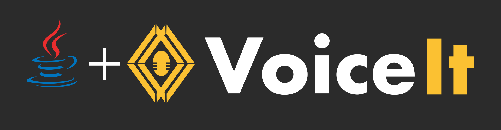

[](https://github.com/voiceittech/voiceit3-java/actions/workflows/test.yml)
[](https://github.com/voiceittech/voiceit3-java/pulls?q=is%3Apr+label%3Adependencies)
[](https://github.com/voiceittech/voiceit3-java)
[](https://github.com/voiceittech/voiceit3-java/blob/main/LICENSE)
[](https://github.com/voiceittech/voiceit3-java)
[](https://voiceit.io)


A Java wrapper for VoiceIt's API 3.0 featuring Voice + Face Verification and Identification.

## Installation

Add as a dependency via Maven:
```xml
<dependency>
  <groupId>com.github.voiceittech</groupId>
  <artifactId>voiceit3-java</artifactId>
  <version>3.0.0</version>
</dependency>
```

Or clone directly:
```bash
git clone https://github.com/voiceittech/voiceit3-java.git
```

## Getting Started

Sign up at [voiceit.io/pricing](https://voiceit.io/pricing) to get your API Key and Token, then log in to the [Dashboard](https://dashboard.voiceit.io) to manage your account.


## API Calls

You can visit our [HTTP API 3.0 Documentation](https://voiceit.io/documentation) for detailed information on each API call.

## Support

If you find this SDK useful, please consider giving it a star on GitHub — it helps others discover the project!

[](https://github.com/voiceittech/voiceit3-java/stargazers)

## License

voiceit3-java is available under the MIT license. See the LICENSE file for more info.

